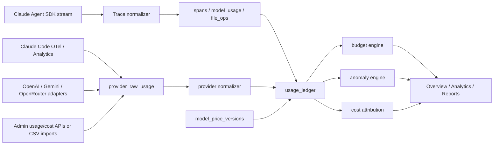

# Billing Guardian Research

访问日期：2026-07-02

目标：把 scry 从“Claude Code SDK 会话观测面板”扩展成面向 Claude、OpenAI、Gemini、OpenRouter 和 agent SDK 的个人/小团队账单卫士。本文只描述事实、可落地判断和待验证问题，不改功能代码。

## 结论

最优切入不是“再做一个通用 LLM observability SaaS”，而是“本地优先的 agent CLI/SDK 成本黑匣子拆解器”。Langfuse、Helicone、LiteLLM 已覆盖生产应用/API Gateway 场景；ccusage、rilldata/claude-usage、claude-code-metrics-stack 已覆盖一部分本地日志/OTel 报表。scry 的差异化必须收窄为：在 agent 执行链内实时解释因果链，把会话、turn、模型调用、skill、hook、文件足迹、git diff、context window、SDK result 和用户刚刚看到的 UI 状态串起来。

第一版应做“单 session 成本解释器 + 证据展开 + 报告导出”，不要把预算、PR 估算、多 provider 对账、模型路由都塞进 MVP。原因：当前 Claude Agent SDK 的 `ModelUsage.costUSD` 和 `total_cost_usd` 是 client-side estimate；tool/skill/MCP 本身没有直接成本字段，只能做 turn 内关联或启发式分摊；OpenAI/Gemini/OpenRouter 的 usage 字段形态不一致；跨供应商路由一旦接入真实 key，就从桌面观测工具变成代理网关，安全和责任边界完全升级。

## 当前 app 能力盘点

| 领域 | 已有能力 | 证据 | 能否直接复用 |
| --- | --- | --- | --- |
| 会话驱动 | Electron + React app 通过 Claude Agent SDK `query()` 驱动本机 Claude Code，而不是旁路 tail terminal transcript。 | `README.md`、`src/main/agent-runner.ts` | 是，Claude MVP 入口。 |
| SDK result 成本 | `result.total_cost_usd`、`usage`、`modelUsage`、`duration_ms`、`duration_api_ms` 已归一化为 `TraceEvent.kind=harness/stage=result`。 | `src/main/normalize.ts` | 是，但 UI 必须标注“估算”。 |
| per-model 用量 | `ModelUsageRow` 持 `model/input/output/cache_read/cache_creation/cost/context_window`。 | `src/shared/trace.ts` | 是，账单分摊主表。 |
| context 占比 | 以最近 assistant usage 的 `input + cache_read + cache_creation` 作为当前 prompt 占用，避免 result usage 累计超过窗口。 | `src/main/normalize.ts` | 是，做 context 异常和 compact 建议。 |
| tool/skill/agent | `classifyTool()` 已识别 `Skill`、`Task/Agent`、普通 tool；UI 有调用明细、拓扑、分段。 | `src/shared/trace.ts`、`OverviewPanel.tsx` | 可用于调用链解释；成本只能按 turn 关联/分摊，不能标成精确 tool 成本。 |
| MCP | 已识别 Claude SDK 原生 `mcp__server__tool` 和 Bash 内 `mcporter call server.action`。 | `parseMcp()` | 是，但 Bash 内非 mcporter 的 MCP/外部 API 无法保证识别。 |
| hook | 已支持 SDK `hook_started/hook_progress/hook_response` 和 transcript hook attachments。 | `src/main/normalize.ts` | stream/UI 可见；当前 SQLite span 未持久化 hook，跨会话 hook 聚合需补 schema。 |
| SQLite 账本 | `projects/spans/model_usage/file_ops`，跨会话聚合 cost/token/tool/model/project/danger。 | `src/main/span-ledger.ts`、`src/main/db.ts` | 是，但需要新增预算/价格/异常表。 |
| usage.jsonl | 每轮 SDK result 轻量追加，SQLite 降级时仍可做累计用量。 | `src/main/index.ts`、`CLAUDE.md` | 是，做导出和故障兜底。 |
| 隐私 | 入库 preview 前已有 Anthropic/OpenAI/GitHub/Slack/AWS/Bearer/JWT 形态脱敏。 | `maskSecrets()` | 是，但账单 key 不应默认接入。 |

现有短板：

1. `costUSD` 是 SDK 客户端估算，不能等同正式账单。
2. 当前跨会话统计只有聚合，缺 per-day rollup、预算窗口、阈值状态、异常 baselines。
3. 当前 app 只驱动 Claude Agent SDK；OpenAI/Gemini/OpenRouter/Codex/OpenCode 等需要 adapter 或导入器。
4. 当前 “MCP 调用”只能识别结构化 tool 名或 `mcporter` 形态，不能识别所有 shell 中的外部调用。
5. 当前只观察，不干预 agent 行为；这应保留为默认边界。
6. 当前 `spans/model_usage` 只有 `harness/result` 持成本/token，tool/skill/agent 没有直接成本；任何 tool/skill/MCP 成本视图都必须带 `attribution_method`。
7. 当前 `file_ops.lines_added/lines_deleted` 为空；PR/diff 只能做触达/关联成本，不能做行级精确分摊。

## 官方能力矩阵

| Provider / SDK | 实时 response usage | 官方历史 usage/cost API | 可分组维度 | cache/reasoning/tool 细节 | 对 scry 的含义 | 置信度 |
| --- | --- | --- | --- | --- | --- | --- |
| Claude Agent SDK TypeScript | `SDKResultMessage` 包含 `total_cost_usd`、`usage`、`modelUsage`、`duration_api_ms`、`session_id`；`ModelUsage.costUSD` 被官方标为 client-side estimate。 | 不是账单 API；只是 SDK 运行结果。 | session/run/model/tool 需要 app 自己从 stream 建账。 | `ModelUsage` 有 cache read/create、web search、contextWindow；`Usage` 有 service tier/speed/inference_geo 等字段。 | MVP 可以实时显示估算和 context/cache 证据，但正式对账必须另接账单/官方统计来源。 | 高 |
| Claude Code / Agent SDK OpenTelemetry | 官方支持导出 traces/metrics/events，覆盖 tool、hook、subagent、模型请求、token/cost 等 telemetry。 | 不是发票；是执行 telemetry。 | trace/span/resource attributes。 | 比 transcript 更标准，适合与 OpenTelemetry 生态对接。 | Beta 应作为 Claude 官方结构化数据源之一，避免只依赖 app 自己的 stream。 | 高 |
| Claude Code Analytics API | 提供 daily、user-level Claude Code 聚合，覆盖 usage、estimated cost、tool accept/reject、token/cache、LOC、commit/PR 等指标。 | 有，偏团队/组织 reporting，不是实时阻断，也不是发票。 | date、actor/user、organization、customer_type、terminal_type、model breakdown 等官方字段；project 维度只能来自本地 `project_key/cwd` heuristic。 | 对团队级生产力/成本分析有价值，但成本字段按 estimated cost 处理。 | Team/Enterprise 可接入；个人 MVP 不依赖。 | 高 |
| Anthropic Claude Platform Usage API | Messages usage report 可按 `1m/1h/1d` bucket 统计 token，并支持 model/workspace/API key/service tier/context window 等过滤/分组；`speed` 维度需 fast-mode beta header。 | 有，需 Admin API key；个人账号不可用；AWS Claude Platform endpoint 暂不可用。 | model、workspace、API key、service tier、context window、geo、speed 等 usage 维度。 | usage 区分 uncached input、cached input、cache creation、output。 | 团队版/企业版用量对账源；不能直接当 cost-by-model 发票。 | 高 |
| Anthropic Claude Platform Cost API | 返回 daily USD cost，主要用于账单/对账；Priority Tier costs 不在 cost endpoint。 | 有，需 Admin API key。 | cost 维度比 usage 维度窄，按 workspace/description 等官方字段处理。 | cost 可含 token/web search/code execution 等 line item，但不等于 usage report 的全部分组。 | 只能承诺 daily official bill，对 model/context/service tier 成本需标为 inferred 或 usage×price estimate。 | 高 |
| OpenAI API | Responses/Completions 返回 usage；Admin usage endpoint 可查 organization completions usage。 | 有 `/organization/usage/completions` 和 `/organization/costs`，需 Admin key。 | usage endpoint 支持 project/user/API key/model/batch/service tier；cost endpoint 支持 project/API key/line_item/quantity/amount，不能承诺 model/user/service_tier 官方 cost 分组。 | usage 示例含 input/output/cached/audio tokens，web/file/code 等各有结果类型。 | OpenAI 侧可做项目/API key 对账；model/user/service_tier 成本必须标为 estimated/inferred。 | 高 |
| Gemini API | `GenerateContentResponse.usageMetadata` 包含 prompt、cached content、candidate、tool-use prompt、thoughts、total token 和 modality details。 | Google AI Studio/Cloud billing历史 API 不在本轮证据内。 | response-level；组织级账单分摊需要后续验证 Google Cloud Billing export。 | 原生区分 cached content、tool-use prompt、thinking thoughts、modalities。 | SDK adapter 可实时记账；正式账单对账暂列待验证。 | 中 |
| OpenRouter | 每个 response 自动包含 `usage`，含 token、credits cost、reasoning token、cached/cache_write token；streaming 在最后 SSE chunk。也可按 generation id 异步获取。 | OpenRouter usage accounting 和 generation 查询可做后验审计；Activity Export 可导出 CSV/PDF，但不等同完整 API。 | request/generation 级；Activity 可按 time/model/API key/creator 等 UI 维度导出。 | `usage.cost` 单位是 credits；`cost_details.upstream_inference_cost` 对 BYOK 场景有意义，可能为 0/null。 | 适合实时 provider-reported cost，但 ledger 必须记录 `cost_unit=credits` 或显式换算来源。 | 高 |
| OpenAI Agents SDK | `result.context_wrapper.usage` 自动汇总每次 run；有 `request_usage_entries` 做 per-request；Session 中每次 `Runner.run()` usage 只代表该次执行。 | 依赖 OpenAI Admin API 做组织级对账。 | run、request、session 由 app 建账。 | cached tokens、reasoning tokens 有字段；第三方 adapter usage 需要验证 include_usage。 | 后续 OpenAI adapter 应按 run/request 双层入库，不要只存 session 总数。 | 高 |

## 竞品与开源调研

| 项目 | 已验证能力 | 关键启发 | scry 不该照搬的部分 |
| --- | --- | --- | --- |
| Langfuse | 开源 AI engineering platform；支持 traces/sessions/observations、MCP tracing、OTLP ingest、token/cost tracking、任意 usage/cost details、自定义模型价格、pricing tiers、Metrics API。 | 数据模型要支持“provider 原始 usage details + 标准化 usage buckets”；价格表必须可版本化和自定义。 | 它已有通用 tool/MCP/agent trace 能力；scry 差异化不应泛称 tracing，而应强调本地 Claude Code 语义、文件/git diff/hook/skill 的开发现场解释。 |
| Helicone | 开源 LLM observability + AI Gateway；成本追踪、session 分组、custom properties、alerts、reports、gateway cost routing、edge cache。 | 成本产品的核心不是单次 token，而是 unit economics：按 session/workflow/feature/user 分摊。缓存优化要报告 hit/saved。 | Gateway 能做拦截/路由，但 scry 第一版本地 app 不应变成中间代理。 |
| LiteLLM Proxy | 虚拟 key、spend tracking、budget/rate limit、key blocking/rotation、model routing/fallback。 | 团队版若要强预算，最好接 gateway/virtual key 层；本地观测层只能软提醒。 | 不要在桌面 app 内重写多租户 proxy；这是团队/企业版可选集成。 |
| ccusage | 本地 CLI，从多种 coding agent CLI 本地日志生成 daily/weekly/monthly/session usage/cost report；支持 5 小时窗口、statusline、JSON、cache token、自定义价格、项目实例。 | “本地、不上传、无需 key、看懂自己的 agent 花费”是个人开发者愿意用的入口。 | 它已经覆盖本地后验统计；scry 机会是实时 UI、turn 证据展开和开发工作流因果解释。 |
| rilldata/claude-usage | 读取本机 `~/.claude/projects` JSONL，做项目、工具、turn、subagent 等 Claude Code 用量分析。 | 本地 transcript 里已经有大量可解释数据。 | scry 不应只做离线报表；必须利用执行时上下文和 UI 状态。 |
| acreeger/claude-code-metrics-stack | 本地 Grafana/OTel stack，追踪 Claude Code cost、tokens、sessions、LOC、tool decisions 等。 | 官方/社区 OTel 路线已存在，接入标准 telemetry 比自造全套更稳。 | scry 不该复制 Grafana dashboard；应做桌面内的任务级解释和 action loop。 |

## 业内前沿做法抽象

1. 双账本：实时估算账本用于当场预警，官方账单账本用于事后对账。两者必须并排展示差异，不能混成一个“准确成本”。
2. usage normalization：保留原始 provider payload，再映射到标准字段：input、output、cache_read、cache_write/create、reasoning/thinking、tool/server-tool、audio/image、request_count、cost、currency。
3. session/workflow unit economics：以 project、session、turn、skill、subagent、tool、MCP、file/diff 为分摊维度，而不是只看 model；但分摊字段必须标注 `direct | turn_allocated | heuristic | unattributed`，不能伪装成精确成本。
4. 软预算优先：桌面 app 先做 warning、projection、stop suggestion、manual checkpoint；硬阻断需要 gateway/permission hook 或 SDK maxBudget，并应由用户显式开启。
5. 价格表版本化：模型价格变化快，必须记录 `price_source`、`effective_at`、`fetched_at`、`confidence`，历史成本不能被新价格静默改写。
6. 隐私本地优先：默认不上传 transcript、不接 admin billing key；任何账单 API/云同步都是 opt-in。

## 功能范围

### MVP：Claude 本地账单卫士

面向个人开发者，完全基于现有 Claude Agent SDK stream、SQLite 和 transcript/usage.jsonl。价值是回答：

1. 这次 `/workflow-orchestrator` 为什么这么贵？
2. 哪个 turn/model/context/cache 直接导致成本/上下文暴涨？
3. 哪些 skill、tool、MCP、hook、文件触达与高成本 turn 相关，归因置信度是什么？
4. 用户下一步是否应该 compact、拆 session、停止疑似循环或导出报告？

MVP 不接 Anthropic Admin API，不要求真实账单 key，不做自动拦截，只做本地估算和解释。

### Beta：多来源导入与对账

接入 Claude Code OTel/Analytics、Anthropic Admin API、OpenAI Admin API、OpenRouter usage/generation/Activity export、OpenAI Agents SDK run usage、Gemini response usage。Beta 不应同时打穿所有 provider，先选择一个官方账单或官方 telemetry connector 完成 reconciliation。所有外部数据都落入 `provider_raw_usage`，再由 normalizer 输出统一 ledger。支持“SDK 估算 vs 官方账单/官方统计”的 reconciliation。

### Team/Enterprise：强预算与治理

不在桌面 app 内重写代理。强预算应通过 LiteLLM/OpenRouter/Helicone/自建 gateway、SDK `maxBudgetUsd`、Claude Code hooks/permission policy、provider 原生 quota/policy（例如 Anthropic Enterprise-only Spend Limits API）对接；Anthropic/OpenAI usage/cost Admin API 属于事后 reporting/对账，不应被写进在线阻断链路。scry 负责可视化、解释、告警、审计和导出。

## 数据模型建议

新增表只作为方案草案，未改代码。

```sql
CREATE TABLE provider_accounts (
  id TEXT PRIMARY KEY,
  provider TEXT NOT NULL,
  label TEXT NOT NULL,
  auth_mode TEXT NOT NULL, -- none | admin_api | api_key | csv | local_log
  created_at INTEGER NOT NULL
);

CREATE TABLE provider_raw_usage (
  id TEXT PRIMARY KEY,
  provider TEXT NOT NULL,
  account_id TEXT,
  source TEXT NOT NULL, -- sdk_result | claude_code_otel | claude_code_analytics | admin_usage | admin_cost | openrouter_generation | openrouter_activity_csv | gemini_response | import_csv
  provider_request_id TEXT,
  trace_id TEXT,
  otel_span_id TEXT,
  parent_span_id TEXT,
  otel_signal TEXT,
  event_name TEXT,
  resource_attributes_json TEXT,
  span_attributes_json TEXT,
  session_id TEXT,
  run_id TEXT,
  actor TEXT,
  terminal_type TEXT,
  ts_start INTEGER,
  ts_end INTEGER,
  raw_json TEXT NOT NULL,
  fetched_at INTEGER NOT NULL,
  confidence TEXT NOT NULL -- exact | provider_reported | estimated | inferred
);

CREATE TABLE usage_ledger (
  id TEXT PRIMARY KEY,
  raw_usage_id TEXT,
  span_id TEXT,
  provider TEXT NOT NULL,
  model TEXT,
  project_key TEXT,
  session_id TEXT,
  run_id TEXT,
  turn_index INTEGER,
  kind TEXT NOT NULL, -- llm | tool | cache | reasoning | server_tool | image | audio | storage | adjustment
  input_tokens INTEGER,
  output_tokens INTEGER,
  cache_read_tokens INTEGER,
  cache_write_tokens INTEGER,
  reasoning_tokens INTEGER,
  tool_tokens INTEGER,
  request_count INTEGER,
  cost_value REAL,
  currency TEXT,
  cost_unit TEXT NOT NULL, -- usd | credits | token | custom
  cost_source TEXT NOT NULL, -- sdk_estimate | provider_reported | provider_bill | official_telemetry | analytics_report | price_table | user_override
  confidence TEXT NOT NULL,
  attribution_method TEXT NOT NULL, -- direct | turn_allocated | heuristic | unattributed
  created_at INTEGER NOT NULL
);

CREATE TABLE model_price_versions (
  id TEXT PRIMARY KEY,
  provider TEXT NOT NULL,
  model_match TEXT NOT NULL,
  price_json TEXT NOT NULL,
  source_url TEXT,
  effective_at INTEGER,
  fetched_at INTEGER NOT NULL,
  confidence TEXT NOT NULL
);

CREATE TABLE budgets (
  id TEXT PRIMARY KEY,
  scope_type TEXT NOT NULL, -- project | session | day | week | month | provider | model | skill | mcp
  scope_key TEXT NOT NULL,
  limit_value REAL NOT NULL,
  currency TEXT DEFAULT 'usd',
  window TEXT NOT NULL, -- run | day | week | month | rolling_5h | custom
  mode TEXT NOT NULL, -- observe | warn | require_confirm | stop
  enabled INTEGER NOT NULL
);

CREATE TABLE budget_events (
  id TEXT PRIMARY KEY,
  budget_id TEXT NOT NULL,
  session_id TEXT,
  run_id TEXT,
  ts INTEGER NOT NULL,
  ratio REAL NOT NULL,
  threshold REAL,
  window_start INTEGER,
  window_end INTEGER,
  source_span_id TEXT,
  severity TEXT NOT NULL, -- info | warn | danger
  message TEXT NOT NULL,
  decision TEXT -- ignored | acknowledged | stopped | raised_limit
);
```

迁移要求：Billing Guardian 第一阶段优先新增表，不回填覆盖现有 `spans/model_usage`；凡是增列必须使用 `PRAGMA table_info` guard 或事务化迁移，避免部分 ALTER 成功后重复执行导致 SQLite 降级 no-op。

## 模块设计

### 1. 成本监控

数据源：现有 `harness/result`、`model_usage`、后续 `usage_ledger`。

核心指标：

- `billed_cost`: 官方账单或官方 cost report，缺失时为空。
- `provider_reported_cost`: provider response/usage 字段报告的成本或 credits。
- `estimated_cost`: SDK estimate 或 price table estimate。
- `display_cost`: UI 展示值，必须带 `cost_source`、`cost_unit`、`confidence`。
- `session_estimated_cost`: 本 session 聚合。
- `turn_cost_delta`: 当前 turn 成本。
- `cost_by_skill/tool/mcp/model/project`: model/turn 可直接聚合；skill/tool/MCP 默认是 `turn_allocated` 或 `heuristic`，UI 必须显示归因方式和未归因占比。
- `official_delta`: 官方账单与本地估算差异。

UI 文案必须区分“估算”和“账单”。Claude SDK 的 per-model `costUSD` 是 client-side estimate，不能标成发票金额。

### 2. 异常告警

规则优先，不上来就做 ML：

| 规则 | 触发 | 行动 |
| --- | --- | --- |
| cost spike | 单 turn 成本 > 最近同项目 P95 或 > 手动阈值 | 右栏 danger + turn 高亮 + 展开贵因子。 |
| context spike | 当前 context/window > 80/95/100% | 提示 compact/拆任务/清理历史。 |
| tool loop | 同一 tool/MCP 在短窗口内重复 N 次且输出相似/失败 | 标记“可能循环”，建议停止。 |
| cache miss regression | 同类任务 cache_read 占比下降，cache_creation 上升 | 提示 prompt/cache key 变化。 |
| runaway subagent | 子 agent turn/tool/cost 超预算 | 显示 subagent cost tree。 |
| hidden shell spend | Bash 输出中出现 provider CLI/API 调用但无结构化 usage | 标记“无法归因，需 adapter”。 |

### 3. 预算上限

MVP 只允许本地 `observe` 和 `warn`。`require_confirm/stop` 可保留在后续 schema 枚举，但 P0 engine/UI 不接受这些模式；`stop` 只在用户显式启用时使用 SDK `maxBudgetUsd` 或 hook/permission 机制，不要默认干预 agent 行为。

预算粒度：

- per run：适合“这次需求最多 $2”。
- per day/week/month：适合个人预算。
- per project：适合 `sample-workspace` 这类项目分摊。
- per skill/MCP：只适合发现“高成本 turn 关联的 workflow”，不是精确 skill/MCP 账单。
- rolling 5h：适合 Claude Code 订阅窗口类体验，但必须标注“估算，不等同 Anthropic 真实限制”。

### 4. 模型路由

MVP 只做 advisor：

- 推荐把规划/审查/实现拆成不同模型或不同 agent profile。
- 根据历史 `cost × success/error × latency × tool count` 给出“这个 workflow 可降级”的候选。
- 不自动改模型，不替用户路由。

Beta/Team 才考虑接入 OpenRouter/LiteLLM/Helicone gateway 做实际路由。理由：路由需要 key 托管、fallback、限流、审计和失败责任。

### 5. 缓存命中分析

标准指标：

- `cache_read_tokens / (input_tokens + cache_read_tokens + cache_write_tokens)`。
- `cache_write_tokens` 趋势。
- `estimated_saved_cost`：只在有价格表/官方 cost details 时计算，否则显示 token saved，不显示美元。
- 按 project/session/skill/model 分组。

### 6. 长任务循环检测

以 agent loop 结构检测，不依赖模型文本：

- 相同 `tool + normalized input` 重复。
- 相同文件反复 Read/Edit 且 git diff 无进展。
- MCP/Bash 失败重试。
- subagent 重复读取同一大文件。
- context 上涨但 `file_ops`、git diff 或 success signal 没变化。

输出是“疑似循环证据”，不是强制停止。

### 7. 每项目成本拆分

当前已有 `cwd`。建议新增可编辑 `project_key`：

- default：cwd basename。
- advanced：git remote、package name、用户标签。
- 对跨 repo workflow，按 span cwd/file path/git diff 分摊。

### 8. PR review 成本估算

输入：

- git diff 行数和文件类型。
- historical similar PR/session。
- prompt/context 大小。
- 模型价格或 SDK estimator。

输出：

- preflight estimate：low/expected/high，而不是单点。
- after-action observed related cost：本地估算 + 关联证据 + 未归因比例；官方对账可作为后续差异。

不要承诺“准确预测”，只能做历史经验估算。

## 架构草图



## 隐私与安全边界

默认：

- 不上传 transcript。
- 不要求 billing/admin API key。
- 不读真实支付信息。
- 不自动修改 agent 行为。
- 不自动路由用户请求到第三方 provider。

Opt-in：

- Admin API key 存系统 keychain，不落 SQLite。
- 原始 provider payload 可配置“只存聚合，不存 prompt/response”。
- 导出报告默认脱敏 key、token、Authorization、JWT。

## 定价建议

这部分是价格假设，不是市场事实。正式定价前必须做目标用户访谈、竞品价格锚点、愿付费测试或 waitlist conversion；不能把下表当作已验证付费意愿。

| 版本 | 价格假设 | 适合人群 | 能力边界 |
| --- | --- | --- | --- |
| Free / OSS local | $0 | 个人开发者验证价值 | 本地单用户、Claude 单 session 解释、有限历史、Markdown 导出；不含多 provider 官方对账。 |
| Personal Pro | 待验证，参考 $9-29/月区间 | 高频 Claude/Codex/OpenCode 用户 | 多 CLI/SDK 导入、预算模板、PR 估算、周/月报、价格表更新、单用户官方对账。 |
| Team | 待验证：per-seat、team base、usage add-on 三种模型都需验证 | 小团队 | 团队项目、成员/项目预算、共享 reports、Slack/email 告警、CSV/BI 导出。 |
| Enterprise | 定制 | 企业 | SSO、审计、managed policy、gateway/LiteLLM/Helicone 集成、数据驻留。 |

价格锚点不应来自“观测面板”，而应来自“每月帮你找出浪费的钱”。这是待验证假设：若产品不能稳定指出可节省项，付费意愿会弱；若能按项目/PR 找出可操作的超支因子，个人版才有定价基础。

## MVP 成功指标

1. 用本地 Claude SDK 数据解释单次 session 的 80% 以上直接成本来源：model、turn、context/cache；skill/tool/MCP 只作为关联证据或分摊证据展示。
2. 对 10 个历史 expensive sessions，人工查看时能在 2 分钟内找到第一成本因子，并能给出下一步动作：compact、拆 session、停止疑似循环、限制 tool/subagent、导出报告。
3. 下一次相似任务中，用户能验证至少一种行为变化：定位时间缩短、重复读取减少、context spike 减少或成本下降。
4. 不引入账单 key 也能完成核心体验。
5. SQLite 和 usage.jsonl 两条持久化链路任一失败时，UI 不崩。

## Open Questions

| 问题 | 为什么没关闭 | 需要的证据 |
| --- | --- | --- |
| Gemini 官方组织级成本 API 如何最小接入？ | 本轮只验证了 response-level `usageMetadata`，没有验证 Google Cloud Billing export 的最小权限/字段。 | Google Cloud Billing export/API 官方文档和字段样例。 |
| Claude Code 订阅额度窗口是否可从本地日志准确反推？ | ccusage 可估算，但 Anthropic 未公开订阅内部限额算法。 | 官方订阅 usage/limit 文档或可重复实验数据。 |
| OpenRouter 组织/团队级 cost export 的最佳 API | 本轮验证 response usage、generation id 和 Activity Export CSV/PDF；未验证完整 account/team usage API。 | OpenRouter Data API 或团队级 account usage API 官方接口详情。 |
| scry 是否应该支持云同步？ | 这是商业/隐私定位决策，不能由技术方案单独决定。 | 目标用户访谈或明确产品策略。 |

## 证据索引

- Anthropic Usage and Cost API：<https://platform.claude.com/docs/en/manage-claude/usage-cost-api>
- Anthropic Spend Limits API：<https://platform.claude.com/docs/en/manage-claude/spend-limits-api>
- Claude Agent SDK TypeScript reference：<https://code.claude.com/docs/en/agent-sdk/typescript>
- Claude Agent SDK observability / OpenTelemetry：<https://code.claude.com/docs/en/agent-sdk/observability>
- Claude Code Analytics API：<https://platform.claude.com/docs/en/manage-claude/claude-code-analytics-api>
- Claude Code hooks reference：<https://code.claude.com/docs/en/hooks>
- OpenAI organization usage completions：<https://developers.openai.com/api/reference/resources/admin/subresources/organization/subresources/usage/methods/completions>
- OpenAI organization costs：<https://developers.openai.com/api/reference/resources/admin/subresources/organization/subresources/usage/methods/costs>
- Gemini GenerateContent API usageMetadata：<https://ai.google.dev/api/generate-content>
- OpenRouter Usage Accounting：<https://openrouter.ai/docs/cookbook/administration/usage-accounting>
- OpenRouter Activity Export：<https://openrouter.ai/docs/cookbook/administration/activity-export>
- OpenAI Agents SDK Usage：<https://openai.github.io/openai-agents-python/usage/>
- Langfuse token and cost tracking：<https://langfuse.com/docs/observability/features/token-and-cost-tracking>
- Langfuse GitHub：<https://github.com/langfuse/langfuse>
- Helicone cost tracking：<https://docs.helicone.ai/guides/cookbooks/cost-tracking>
- Helicone caching：<https://docs.helicone.ai/features/advanced-usage/caching>
- Helicone custom rate limits：<https://docs.helicone.ai/features/advanced-usage/custom-rate-limits>
- Helicone GitHub：<https://github.com/Helicone/helicone>
- LiteLLM virtual keys：<https://docs.litellm.ai/docs/proxy/virtual_keys>
- ccusage GitHub：<https://github.com/ccusage/ccusage>
- ccusage guide：<https://ccusage.com/guide/>
- rilldata/claude-usage：<https://github.com/rilldata/claude-usage>
- acreeger/claude-code-metrics-stack：<https://github.com/acreeger/claude-code-metrics-stack>
