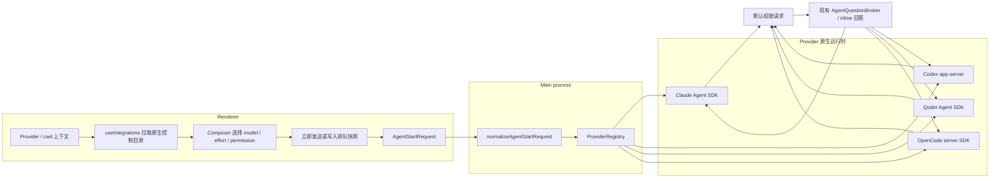

# Scry 对齐 CodePilot 聊天控制

## 1. 背景与目标

把 Scry 的聊天主路径收敛到 CodePilot 0.62 的信息层级：Skill/MCP 从左下移到右上，
model/effort 放进 composer，权限放在 composer 下方；所有选择必须沿 Provider 原生链路真实生效。

不重构 Graph、Segments、Analytics，也不替换已交付的工作区文件树和 Markdown 编辑器。

## 2. 整体流程



## 3. 改动清单

### 共享契约与 IPC

- `src/shared/runtime.ts`
  - 新增 model option、effort option、permission option、catalog 与逐轮 selection 类型。
  - `AgentStartRequest` / `NormalizedAgentStartRequest` 新增 `model`、`effort`、`permissionMode`。
  - 缺字段的老调用继续按当前行为归一化为 `full_access`；新 UI 显式发送用户选择。
  - model 使用结构化 `AgentModelRef { id, providerId? }`；OpenCode 必须携带
    `providerId`，其他 Provider 只使用 `id`。
- `src/main/providers/types.ts`、`registry.ts`
  - Provider adapter 新增可选 `runControls` facet。
  - `ProviderRunRequest` 承载归一化后的三项选择。
- `src/main/index.ts`、`src/preload/index.ts`、`src/renderer/env.d.ts`
  - 新增 `agent:runControls` IPC；启动时把选择传入 registry。

### Provider 原生实现

- Claude
  - 用 Agent SDK control initialization 的 `supportedModels()` 读取真实模型与 effort。
  - run options 下发 `model` / `effort`。
  - `default` 通过 `canUseTool` 接入现有 inline 问答；`auto_review` 映射 `auto`；
    `full_access` 保持当前 bypass。
- Codex
  - 用 app-server `model/list` 读取模型与 `supportedReasoningEfforts`。
  - `thread/start|resume` 与 `turn/start` 下发 model / effort / approval reviewer / sandbox。
  - 扩展 app-server client 的 server-request handler，把命令与文件修改审批接入现有 inline 问答。
    JSON-RPC request id 保留在 main 内部 closure，通用 broker 只返回用户选择；adapter 负责翻译成原生
    `accept/decline` response。
- Qoder
  - 复用现有 control session 的 `getAvailableModels()`。
  - model + effort 通过 `resolveModel` 原生参数下发。
  - 三档权限映射为 default / auto / bypass。
- OpenCode
  - 用 `v2.model.list()` 读取模型与 variants，variant 作为该模型的 effort 档位。
  - prompt 下发 model / variant；session permission rules 实现 default / full access。
  - `permission.asked` 通过现有 inline 问答后调用原生 permission reply。

### Renderer

- `Sidebar.tsx` 删除左下 Skill/MCP footer。
- `ViewChrome.tsx` 在右上加入 Skill/MCP 按钮、数量与连接态。
- `useIntegrations.ts`
  - 按 Provider/cwd 拉取 catalog。
  - 使用递增 request sequence 丢弃迟到响应；缓存键为
    `providerId + cwd`，Provider control probe 使用 30 秒 TTL / 5 秒 idle close。
  - 选择按 Provider 暂存在 renderer，目录刷新后校验并清除失效值。
  - model 改变时同步清空不再受支持的 effort。
  - 默认 model/effort 为“自动”（不下发），默认权限为 `default`。
- `Pickers.tsx`
  - Agent picker 改为文字化，新增通用 model/effort/permission picker。
- `ChatView.tsx`、`styles.css`
  - composer 改为 CodePilot 式浮起圆角容器。
  - model/effort 在容器内，Agent 与权限在下方控制条。
  - 运行中禁用所有运行控制，避免已排队输入和选择发生漂移。
- `App.tsx`
  - 传递右上入口、catalog/selection 和变更回调。
  - `startPrompt` 显式发送三项选择。
  - 排队项保存完整运行快照（cwd、provider、agent、backend、model、effort、permission），自动启动时
    不重新读取当前 UI 状态。

### 测试

- shared normalize：新字段、空值、老调用兼容。
- Provider：目录映射与 run 参数下发；默认/自动审查/完全访问映射。
- Codex app-server：server request 正确回复且不会串到其他 run。
- Renderer：左下入口消失、右上入口存在、effort 随模型能力变化、提交请求带三项选择。
- Renderer：迟到 catalog 不覆盖新上下文；排队项按入队快照启动。
- Trace：每轮归档包含请求的 model / effort / permission 运行控制证据。

## 4. 公共契约变更

```diff
 interface AgentStartRequest {
   prompt: string
+  model?: { id: string; providerId?: string }
+  effort?: string
+  permissionMode?: 'default' | 'auto_review' | 'full_access'
 }

 interface ProviderRunRequest {
   ...
+  model?: string
+  effort?: string
+  permissionMode: AgentPermissionMode
 }
```

兼容策略：

- 老 renderer / 测试不传权限时，main 归一化为 `full_access`，保持改动前行为。
- 新 renderer 总是显式发送当前权限；默认展示 `default`。
- model.id / model.providerId / effort 空字符串归一化为 `undefined`，表示 Provider 自动选择。
- OpenCode 收到缺 `providerId` 的 model ref 时拒绝启动；其他 Provider 忽略 `providerId`。
- catalog 中不存在的旧选择在 Provider/cwd 切换时清除，不把失效值下发。
- 不修改 session archive / app-store 格式；模型仍由运行结果作为权威证据记录。
- main 在 Provider 启动前追加 `runtime:controls` harness event，保存请求的 model / effort /
  permission；它随既有 trace/archive 持久化，不修改 session store schema。

## 5. 配置与开关

- 新增进程级 kill switch：`SCRY_RUN_CONTROLS=0`。
- 关闭时，catalog 只返回“Provider 自动模型 / 自动 effort / 完全访问”，main 忽略显式控制并保持改动前
  的 full-access 行为；可不重新发版关闭新运行控制。
- 默认开启。

旧 preload 不含 `runControls` 时，renderer 只显示“自动模型 / 自动 effort /
完全访问（需重启）”，不伪装成默认审批。

## 6. 决策记录与开放问题

### 设计决策

- 权限统一为 `default / auto_review / full_access`，每个 Provider 只返回自己真实支持的档位。
- 支持矩阵与原生映射如下；adapter 收到 catalog 未声明的档位必须 fail closed，不能静默降级：

| Provider | default | auto_review | full_access |
|---|---|---|---|
| Claude | omit permission mode + `canUseTool` | `permissionMode=auto` | `bypassPermissions` |
| Codex | `on-request + reviewer=user + workspace-write` | `on-request + reviewer=auto_review + workspace-write` | `never + danger-full-access` |
| Qoder | `permissionMode=default + canUseTool` | `permissionMode=auto` | `bypassPermissions` |
| OpenCode | session rule `ask` + native reply | 不支持，不进 catalog | session rule `allow` |

- “自动” model/effort 不下发，保留 Provider 自己的配置和路由逻辑。
- effort 由所选模型目录派生；模型不声明能力时不显示 effort 控件。
- 运行中禁用控制，当前运行和排队输入共用同一组不可漂移的选择。
- 默认审批复用现有 inline 问答，不再造第二套权限弹窗。
- 通用 `AgentQuestionRequest/Response` 不承载原生 RPC/request id；每个 adapter 在发起 broker
  请求的 closure 内保存 id，并把答案翻译回自己的协议。

### 主动偏离

- 按用户要求把 Skill/MCP 放到右上；CodePilot 0.62 原实现实际仍在左侧“插件”入口。
- 保留 Scry 的 Provider 健康状态、Graph/Segments/观测面板，不做 CodePilot 的整产品复制。

### 权衡取舍

- 否决静态硬编码模型表：会过期，也无法正确约束 effort。
- 否决只做 renderer 选择器：会产生“看起来可选、运行时仍是 bypass”的假功能。
- 否决在本任务扩展 session store：运行选择可逐轮下发，历史权威模型已由 trace/result 记录；
  额外迁移与用户目标无关。
- 否决默认权限直接映射到现有 bypass：标签与实际风险语义冲突。

### 开放问题

N/A。用户已明确位置与控制项；其余行为可从 Provider 原生契约和 CodePilot 0.62 参考确定。

### Critic 漏洞取舍（原文）

1. **[BLOCKER] 默认审批无法复用现有 inline 问答契约闭环。**
   “RFC 只新增运行选择类型，没有定义通用权限请求/响应类型；Claude/Qoder 的 `canUseTool`、
   Codex 的 JSON-RPC server request、OpenCode 的 `permission.asked/reply` 需要不同原生响应。”
   **[纠偏→**通用问答契约足够承载人的选择；原生 id 与响应翻译必须留在 adapter closure，已写明**]**
2. **[BLOCKER] 三档权限在四个 Provider 上没有统一且可验证的语义。**
   **[采纳→**新增支持矩阵、catalog 约束与 fail-closed 规则**]**
3. **[BLOCKER] OpenCode 模型标识与公共写入格式不一致。**
   **[采纳→**改为结构化 `AgentModelRef`，OpenCode 强制 providerId**]**
4. **[MAJOR] catalog 没有并发隔离、缓存键、失效版本或请求代次。**
   **[采纳→**新增 context key、request sequence、TTL/idle close 和 effort 失效规则**]**
5. **[MAJOR] 排队消息没有选择快照，和“不漂移”决策冲突。**
   **[采纳→**排队项保存完整 `AgentStartRequest` 快照**]**
6. **[MAJOR] 无发版外退路，也缺少运行态证据。**
   **[采纳→**新增 `SCRY_RUN_CONTROLS=0` 与 `runtime:controls` trace 证据**]**
