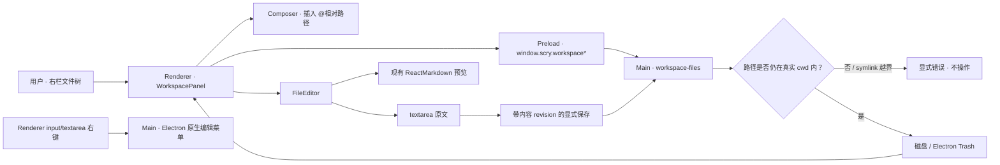

# Scry 工作区文件树与 Markdown 单页编辑

## 1. 背景与目标

Scry 已能选择 cwd、驱动 Agent 和展示聊天 Markdown，但用户不能在应用内浏览/管理工作区文件，也不能打开并编辑 Markdown。目标是把 CodePilot v0.62.0 截图中明确列出的三项能力接入现有 Scry：右侧工作区文件树、同页 Markdown 编辑/预览、输入控件原生右键菜单。

交付口径：

- 文件树按需展开，支持新建文件/文件夹、重命名、移入系统废纸篓、刷新、添加文件或目录引用到 composer。
- 文本文件可打开和保存；Markdown 在同一文件页同时显示原文编辑区与渲染预览。
- 普通 input、textarea 和文件编辑器使用 Electron 原生撤销/剪切/复制/粘贴/全选菜单；密码输入不开放该菜单。
- 不新增第二套会话、附件或 Markdown 主题系统。

## 2. 整体流程



关键不变量：

1. 所有 renderer 传来的 cwd/path 都是不可信输入；main 每次操作校验 IPC sender、重新解析 canonical root，并拒绝越界和任一 symlink 路径分段。
2. Markdown 原文是唯一事实源；预览只是派生视图，不写回 HTML。
3. 本轮不启用自动保存。打开其他文件、返回文件树、关闭 workspace、切换 cwd、重命名或删除命中未保存文件时都由 renderer 阻止或要求确认，避免静默丢稿。
4. 删除只能调用 `shell.trashItem`；Trash 不可用时失败，不降级为永久删除。
5. 文件树状态局部化在 WorkspacePanel，不进入聊天 turn 热渲染链路。

## 3. 改动清单

### Shared

- `src/shared/workspace.ts`
  - 新增 `WorkspaceEntry`、`WorkspaceFileSnapshot`、list/read/write/create/rename/trash 请求类型。
  - 所有 entry path 使用相对 cwd 的 `/` 分隔格式；绝对路径不暴露给 renderer。

### Main / Preload

- `src/main/workspace-files.ts`
  - canonical cwd、segment-boundary 检查、逐分段 symlink 拒绝、文本/大小门禁。
  - lazy directory listing、文件读取、内容 revision 冲突保存、排他新建、同目录重命名、Trash 删除。
  - 保护 `.git`、`node_modules`、`dist`、`build`、`out`、`target`、`.next`、`.scry`，避免误操作仓库元数据或大生成目录。
- `src/main/workspace-files.test.ts`
  - 覆盖路径穿越、绝对路径、保护目录、symlink 越界、二进制/无效 UTF-8、保存冲突、重名覆盖、Trash fail-closed。
- `src/main/index.ts`
  - 注册 workspace IPC。
  - 为当前 BrowserWindow 注册原生 editable context menu。
- `src/preload/index.ts`、`src/renderer/env.d.ts`
  - 暴露精确的 workspace API，不暴露任意 fs primitive。

### Renderer

- `src/renderer/components/WorkspacePanel.tsx`
  - 右栏文件树、按需展开、搜索/刷新、空白区与节点右键菜单。
  - 自定义新建/重命名/Trash 确认 UI；删除文案明确“移入系统废纸篓，可恢复”。
  - 文件打开后显示编辑页；任何会离开当前文件/cwd 的动作都经过统一 dirty guard，窗口关闭再由 `beforeunload` 兜底。
  - Markdown 文件显示编辑/预览双栏；其他受支持文本文件显示单编辑区。
- `src/renderer/App.tsx`
  - 新增 workspace 右栏模式，与 overview/review 明确互斥；review 优先级最高。
  - Agent 一轮结束后让打开的文件树失效并重拉，外部 Finder/终端改动仍保留手动刷新入口。
  - “添加到对话”只向 composer 插入可见的 `@relative/path` token，并聚焦输入框，不伪造图片附件或隐藏提示词。
- `src/renderer/components/ViewChrome.tsx`
  - 新增“文件”右栏开关。
- `src/renderer/components/AppShell.tsx`
  - 扩展 `rightPanelMode` 为 `workspace`，沿用既有 splitter。
- `src/renderer/styles.css`
  - 复用 Scry token，补文件树/菜单/编辑器/预览样式；高频树操作不加动画。
- `src/renderer/components/render.test.tsx`
  - 覆盖文件入口、可恢复删除文案与 reference token 的格式/去重。

## 4. 公共契约变更

新增 IPC，不修改现有 Agent Provider 和持久化 transcript 契约：

```text
workspaceList({ cwd, path? }) -> { entries, truncated }
workspaceRead({ cwd, path }) -> WorkspaceFileSnapshot
workspaceWrite({ cwd, path, content, expectedRevision }) -> WorkspaceFileSnapshot
workspaceCreate({ cwd, parentPath?, name, kind }) -> WorkspaceEntry
workspaceRename({ cwd, path, name }) -> WorkspaceEntry
workspaceTrash({ cwd, path }) -> true
```

兼容策略：

- 所有新方法在 renderer 的 `env.d.ts` 标为必需；Scry main/preload/renderer 同版本发布，无跨版本 IPC 兼容需求。
- 现有 `AgentInputAttachment` 继续只表示图片，避免四个 Provider adapter 的输入契约膨胀。
- 文件引用是用户可见 composer 文本，不引入新的 transcript 字段；旧会话无需迁移。
- 文件快照的 `revision` 是对受限文本内容计算的 SHA-256；保存前重新计算当前内容并比较。`mtimeMs` 只用于展示，不伪装成可靠版本号。磁盘发生外部修改时保存失败并要求重新载入。

## 5. 配置与开关

N/A。该能力只在存在 cwd 且 chat 视图打开，默认通过“文件”按钮显式进入；没有后台 watcher、定时器或自动保存，不需要环境变量或 feature flag。

固定门禁：

- 单文件读取/保存上限 2 MiB。
- 目录单次最多返回 2,000 个直接子节点，并返回 `truncated`。
- 二进制文件拒绝进入文本编辑器。

## 6. 决策记录与开放问题

### 设计决策

- 文件树放在既有右栏，而不是挤入历史会话左栏。依据是 CodePilot 参考界面和 Scry 左栏已经承担项目/会话导航；右栏已有 splitter、折叠和 chat-only 语义。
- workspace、overview、turn review 三种右栏模式互斥；打开 workspace 不同时加载 OverviewPanel 的 MCP/账单内容。
- 文件引用落成可见 `@relative/path` token。它跨 Claude/Codex/Qoder/OpenCode 均是普通、可审计文本，不依赖某个 Provider 的私有附件协议。
- 只做手动保存 + 内容 revision 冲突保护。Scry 没有现成 file-owner transaction；在首版引入 autosave 会把 rename/delete/save 竞态一起带入。

### 主动偏离

- 不照搬 CodePilot 的“活动行源码、非活动行 decoration 渲染”式 CodeMirror Live Preview，而是同页原文编辑 + 渲染预览。用户截图要求的是“预览和编辑在同一页面”；当前方案能完整满足这点，并继续复用 Scry 现有 Markdown 视觉契约。CodeMirror decoration 还要求表格/图片/Mermaid/数学 parity、IME 与超长文性能矩阵，超出这次从零文件编辑器的最小可靠边界。
- 不复制 CodePilot 的第三方文件类型图标资产。截图列出的核心能力是文件管理、Markdown 同页编辑/预览和右键菜单；Scry 首版复用现有 `Icon`，避免引入 50 个静态资产与许可证管线。
- Markdown 首版沿用现有 `react-markdown + remark-gfm` 契约；相对图片、Mermaid 与 KaTeX 不在这次截图列出的交付面内，遇到时保留源码/alt，而不伪造已支持状态。

### 权衡取舍

- 否决“把文件/目录扩展成 `AgentInputAttachment`”——会迫使四个 Provider adapter、历史 transcript 和图片渲染同时支持联合类型；可见 reference token 更小且语义清楚。
- 否决“直接在 renderer 使用 Node fs”——破坏 Electron 边界，无法集中做 cwd/symlink/Trash 安全门禁。
- 否决“删除失败时回退永久删除”——与“系统废纸篓可恢复”的产品承诺冲突。
- 否决“首版自动保存”——没有跨 owner mutation coordinator 时会发生旧路径复活。
- 否决“只用 `mtimeMs` 判断保存冲突”——部分文件系统时间粒度不足，同一时间片内同尺寸覆写可能漏判；2 MiB 上限内计算内容 revision 的成本可控。

### 开放问题

无阻塞开放问题。若后续要求与 CodePilot decoration Live Preview 完全同构，应作为独立任务引入 CodeMirror 6，并补齐相对图片、Mermaid/KaTeX、IME 和 100 KiB+ 文档性能验收。
